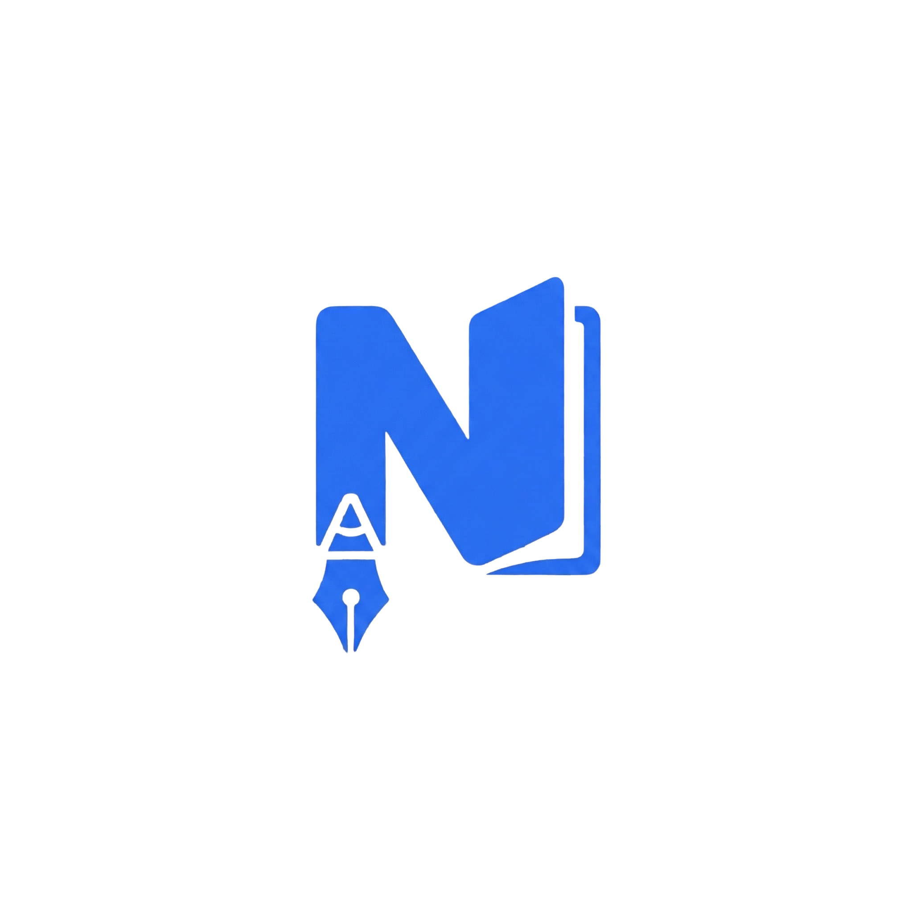

# Notomattic

A privacy-first, native note-taking application built by [Automattic](https://automattic.com). Features WYSIWYG editing, daily notes, calendar integration, and wiki-style linking.



## Download

**[Download Latest Release](https://github.com/Automattic/notomattic/releases)**

### macOS

1. Download the DMG for your Mac:
   - **Apple Silicon** (M1/M2/M3): `Notomattic_x.x.x_aarch64.dmg`
   - **Intel**: `Notomattic_x.x.x_x64.dmg`
2. Open the DMG and drag **Notomattic** to Applications
3. Double-click to launch

The app is signed and notarized by Apple, so it opens without any security warnings.

### Windows (Experimental)

> **Note:** Windows support is experimental. Some features like calendar integration are macOS-only, and you may encounter issues.

1. Download `Notomattic_x.x.x_x64-setup.exe`
2. Run the installer
3. Windows SmartScreen may show a warning - click **More info** → **Run anyway**

### System Requirements

- **macOS:** 10.15 (Catalina) or later, Apple Silicon or Intel
- **Windows:** Windows 10 or later, 64-bit (experimental)

## Features

- **WYSIWYG Editor** - Rich text editing with full formatting support
- **Daily Notes** - Automatic daily note creation
- **Wiki-Style Links** - Connect notes with `[[Note Name]]` syntax
- **Calendar Integration** - Native macOS calendar support (macOS only)
- **Dark Mode** - System preference sync
- **Privacy First** - All notes stored locally, no cloud sync

## Development

### Prerequisites

- Node.js 18+
- Rust 1.70+
- Xcode Command Line Tools (macOS)

### Setup

```bash
npm install
npm run tauri dev
```

### Build

```bash
npm run tauri build
```

## Tech Stack

- **Frontend:** React 19, TypeScript, Vite
- **Backend:** Tauri (Rust) with Swift integration
- **Editor:** TipTap (ProseMirror-based)
- **State:** Zustand
- **Styling:** Tailwind CSS

## License

Proprietary - All rights reserved

---

Made with care by [Automattic](https://automattic.com)
