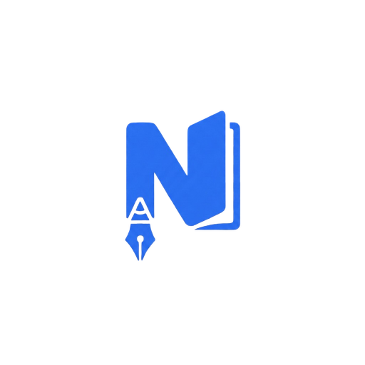

<p align="center">
  
</p>

<h1 align="center">Moldavite</h1>

<p align="center">
  <em>Your thoughts, forged from cosmic impact.</em>
</p>

<p align="center">
  
  
  
</p>

---

### The Story

Moldavite is a rare green gemstone formed 15 million years ago when a meteorite struck Earth. The impact was so intense it fused terrestrial and extraterrestrial matter into something entirely new.

This app carries that spirit. Your notes live only on your Mac—fused with your workflow, shaped by your thinking, belonging entirely to you. No cloud. No accounts. No tracking.

---

### Download

**[Get the latest release →](../../releases/latest)**

| Mac | File |
|-----|------|
| Apple Silicon | `Moldavite_x.x.x_aarch64.dmg` |
| Intel | `Moldavite_x.x.x_x64.dmg` |

---

### What You Get

**Local-first privacy** — Notes stored in your [Forge](docs/FORGE.md) — a folder of plain `.md` files at `~/Documents/Moldavite/`. Sync it, back it up, or edit it in any other tool.

**Rich editing** — Markdown shortcuts, `[[wiki links]]`, images, code blocks, task lists.

**Safe note renaming** — Rename standalone notes from the sidebar or editor while Moldavite updates inbound `[[wiki links]]` and keeps open tabs in place.

**Daily notes** — One click to today's note. Apple Calendar in the sidebar.

**Connected thinking** — Backlinks panel shows every note that links to the current one. The force-directed graph pulls linked notes into visible clusters and keeps unlinked notes at the periphery. Folders when you need them, tags when you don't.

**Full-text search** — Ranked content search across every note, with snippets.

**Semantic search (optional)** — Find notes by meaning, not just keywords, plus a "Related" list for the note you're reading. Choose between three local embedding models (all-MiniLM-L6-v2 is the default); the selected model downloads once after you opt in, then everything runs fully offline — your notes never leave your Mac.

**Timeline** — Chronological feed of notes bucketed by Today / Yesterday / This Week / This Month / Earlier, with calendar events inline on macOS.

**Trash with previews** — Deleted notes sit in a sidebar popover for 7 days with read-only previews before permanent delete.

**Note locking** — Encrypt individual notes with a password (AES-256-GCM + Argon2). Locked notes stay encrypted on disk and auto-relock.

**Encrypted backups** — Export your entire vault as a password-protected AES-256 archive. Settings can be exported as JSON for cross-device sync.

**Crash-safe by design** — Every save is atomic (write + flush + rename), so a crash or full disk can never truncate a note. Files are owner-readable only.

**Sync-friendly** — Point iCloud Drive, Dropbox, Syncthing, or git at your Forge. If a note changes on disk while you're editing it in Moldavite, the external version is preserved as a conflict copy instead of being overwritten.

**Automatic updates** — Moldavite checks for new versions and updates in place. After updating, a "What's New" popup summarizes the changes.

**Plugins** — build sandboxed command integrations with permissioned unlocked-note reads, exact-host HTTPS requests (including individually revocable runtime host grants), trusted app-rendered forms, and plugin-owned macOS Keychain secrets. Every install shows a reopenable setup and permissions guide. Install the bundled **Publish to WordPress** reference from Settings to publish/update drafts with Application Passwords. Plugins live in your Forge, every capability is host-enforced, and manifest/code changes re-prompt for consent; see [docs/PLUGINS.md](docs/PLUGINS.md).

**Agent-ready** — your Forge is plain Markdown, so AI agents (Claude Code, etc.) can read and write it directly. Settings → AI & Agents generates an `AGENTS.md` describing your vault's conventions to agents, plus a `.gitignore` for app-managed folders.

**Built-in MCP server** — connect Claude Code, Claude Desktop, or another MCP client directly to the Moldavite app binary with `--mcp`. Search, reading, note listing, and backlinks are always available; note writes are an explicit opt-in in Settings → AI & Agents.

**Keyboard-first** — `⌘/Ctrl + ?` reveals every shortcut.

---

### Screenshots

<p align="center">
  <em>Coming soon</em>
</p>

---

### Build It Yourself

```bash
git clone https://github.com/mauropereiira/moldavite.git
cd moldavite
npm install
npm run tauri dev
```

Requires Node.js 18+, Rust 1.77+, and Xcode CLI tools. See
[CONTRIBUTING.md](CONTRIBUTING.md) for the project map, test commands, conventions,
and pull request expectations.

---

### Stack

React · TypeScript · TipTap · Tauri 2 · Rust · Swift · Tailwind

---

<p align="center">
  <sub>Made by <a href="https://github.com/mauropereiira">Mauro Pereira</a></sub>
</p>
