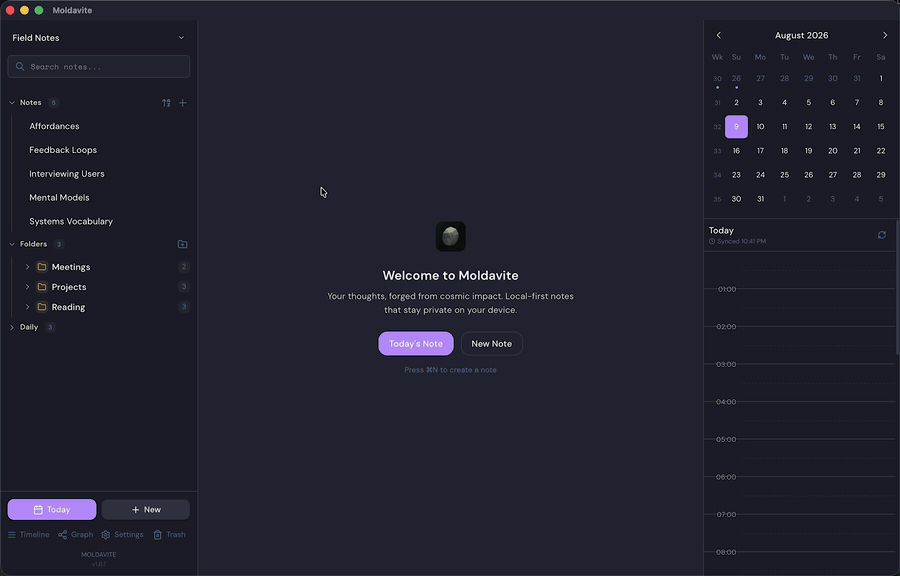
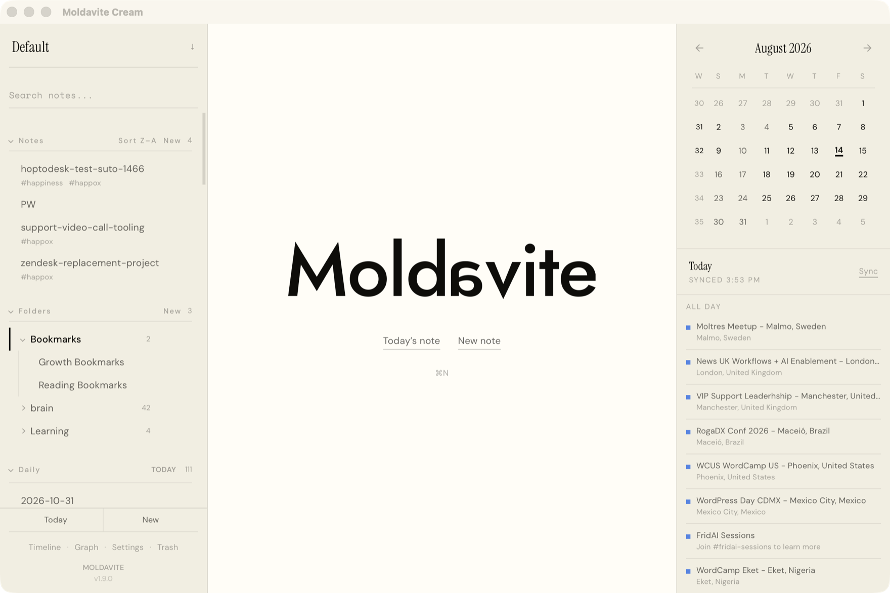
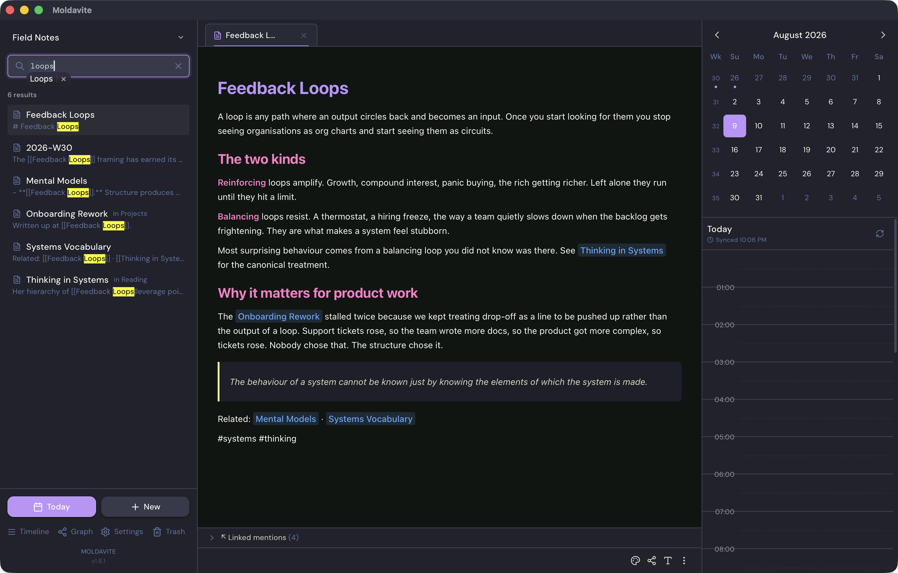
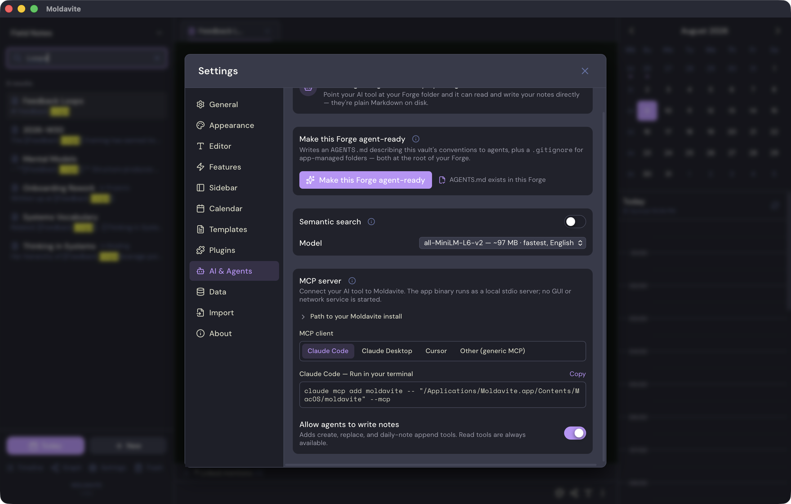

<p align="center">
  
</p>

<h1 align="center">Moldavite</h1>

<p align="center">
  <em>A notes app that never takes your notes.</em>
</p>

<p align="center">
  <a href="https://github.com/mauropereiira/Moldavite/releases/latest"></a>
  
  
</p>

<p align="center">
  <a href="https://mauropereiira.github.io/Moldavite/">Website</a> ·
  <a href="https://mauropereiira.github.io/Moldavite/guide.html">User Guide</a> ·
  <a href="https://github.com/mauropereiira/moldavite-skills">Agent Skills</a> ·
  <a href="https://github.com/mauropereiira/homebrew-moldavite">Homebrew tap</a> ·
  <a href="CHANGELOG.md">Changelog</a>
</p>

<p align="center">
  
</p>

---

Moldavite is a notes app for macOS. Your notes are plain Markdown files in a
folder you own. There is no account and no sync service.

Open that folder in Finder, put it in git, edit it in another app, and Moldavite
picks up the change. It also runs an MCP server, so Claude and other AI tools can
read your notes on your machine. Read tools are on by default. Writing stays off
until you switch it on.

## Install

```sh
brew install --cask mauropereiira/moldavite/moldavite
```

Or [download the latest release](https://github.com/mauropereiira/Moldavite/releases/latest)
and drag it to Applications:

| Mac | File |
|-----|------|
| Apple Silicon | `Moldavite_x.x.x_aarch64.dmg` |
| Intel | `Moldavite_x.x.x_x64.dmg` |

Builds are signed and notarized, so macOS opens them without a warning. Requires
macOS 10.15 or later. Updates install themselves after a minisign check.

## What it looks like



Notes, folders and daily notes on the left, the editor in the middle, your
calendar on the right.



Search reads every note in the Forge and shows you the line that matched.


The graph is built from your `[[wiki links]]`. Links that point nowhere yet stay
visible as hollow nodes instead of disappearing.



Settings has one panel for the whole agent story: the setup command for your
client, and the switch that decides whether agents can write.

## Connect your AI

The app binary is also the MCP server. There is no separate daemon, and nothing
leaves your machine.

```sh
claude mcp add moldavite -- "/Applications/Moldavite.app/Contents/MacOS/moldavite" --mcp
```

If you installed with Homebrew, `moldavite` is already on your `PATH`:

```sh
claude mcp add moldavite -- moldavite --mcp
```

Settings → AI & Agents generates the right line for Claude Code, Claude Desktop,
Cursor, or any stdio MCP client. Add `--forge "Work"` to pin a client to one
Forge instead of following whichever Forge is open.

| Tool | Does | Default |
|------|------|---------|
| `list_notes` | Enumerate notes and locked-note placeholders, optionally by folder | On |
| `read_note` | Read one unlocked note by Forge-relative path | On |
| `search_notes` | Ranked full-text search with snippets | On |
| `get_backlinks` | Every note linking to a given note | On |
| `create_note` | Create a note | **Off** |
| `write_note` | Replace a note's contents | **Off** |
| `append_to_daily_note` | Append to today's note | **Off** |

Turn the write tools off again and they vanish from the tool list mid-session.
Locked notes are excluded from all seven.

Some agents read files directly and never speak MCP. For those, one click writes an `AGENTS.md`
describing your Forge's conventions, plus a `.gitignore` for the directories the
app manages itself.

**[Moldavite Skills](https://github.com/mauropereiira/moldavite-skills)** teach an
agent how to use all of this. They follow the Agent Skills spec, so they work in
Claude Code, Codex, and OpenCode:

```sh
/plugin marketplace add mauropereiira/moldavite-skills
/plugin install moldavite@moldavite-skills
```

## The Forge

A **Forge** is a vault. It is an ordinary directory holding ordinary files, and
you can keep as many as you like:

```
~/Documents/Moldavite/<ForgeName>/
├── daily/         # YYYY-MM-DD.md, created on demand, removed when emptied
├── weekly/        # YYYY-Www.md
├── notes/         # standalone notes, nested folders supported
├── templates/     # custom templates (JSON)
├── images/        # pasted and inserted images
├── .trash/        # 7-day retention
└── .plugins/      # installed plugins
```

Every write is atomic. A crash or a full disk cannot leave you with half a note.
If a file changed on disk while you had unsaved edits, the disk version is kept
as a timestamped conflict copy.

## What else it does

- **Writing.** Rich-text editing over Markdown-on-disk: headings, task lists,
  code, resizable images, slash commands, pinnable tabs, and formatted paste
  for recognizable raw Markdown.
- **Linking.** `[[Wiki links]]` and `[[Display|target]]`. Renaming a note
  rewrites every inbound link across the vault and keeps your open tabs pointed
  at the right file.
- **Finding.** Backlinks panel, `#tags` with global rename, folders, and a quick
  switcher on `⌘P`. Search is a live scan, which is comfortable to roughly a
  thousand notes.
- **Semantic search.** Optional. Pick one of three embedding models, approve the
  download, and everything after that runs offline. Apple Silicon only; Intel
  Macs get keyword search.
- **Locking.** Individual notes encrypt with AES-256-GCM and Argon2, with
  rate-limited unlock and auto-relock. Locked notes stay out of search, indexing,
  and every agent tool.
- **Calendar.** Apple Calendar through EventKit and Google Calendar through a
  read-only OAuth scope. Events are drawn and discarded. Moldavite never creates
  or changes one.
- **Plugins.** Each runs in its own Web Worker with no DOM, no network globals,
  and no Tauri IPC. Consent is pinned to a hash of the plugin's code, so any
  change asks you again. See [docs/PLUGINS.md](docs/PLUGINS.md).
- **Moving in and out.** One-time Obsidian vault import, ZIP and encrypted
  exports, per-note Markdown and PDF export.

## Privacy

No account system, no hosted notes service, no analytics, no telemetry.

Moldavite makes five network calls, all of them on purpose: a signed update check
about fifteen seconds after launch and once a day while open; the plugin registry
from GitHub when you press Browse; a semantic model from Hugging Face after you
opt in; Google Calendar while a Google account is connected; and plugin requests
to hosts you approved by name.

Publishing a note to WordPress is an action you take. Full detail in the
[Privacy Policy](https://mauropereiira.github.io/Moldavite/privacy.html).

## Contributing

[CONTRIBUTING.md](CONTRIBUTING.md) has the setup, commands, and conventions.
[docs/ARCHITECTURE.md](docs/ARCHITECTURE.md) explains how the pieces fit
together. [docs/PROJECT_STATUS.md](docs/PROJECT_STATUS.md) tracks what ships,
what is broken, and what is next.

---

<p align="center">
  <sub>Made by <a href="https://github.com/mauropereiira">Mauro Pereira</a> · MIT License</sub>
</p>
