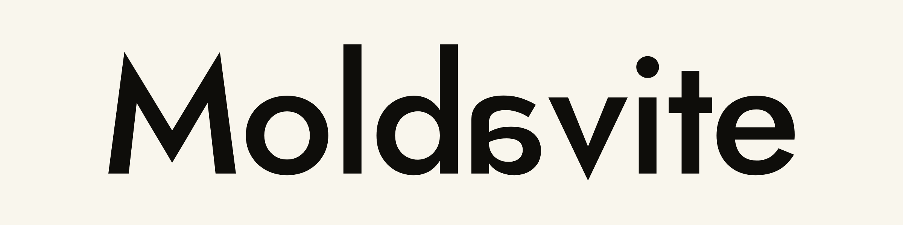

<picture>
  <source media="(prefers-color-scheme: dark)" srcset="docs/banner-dark.png">
  
</picture>

<p align="center">
  <a href="https://mauropereiira.github.io/Moldavite/">Website</a> ·
  <a href="https://mauropereiira.github.io/Moldavite/demo.html">Try it in your browser</a> ·
  <a href="https://mauropereiira.github.io/Moldavite/guide.html">Guide</a> ·
  <a href="https://github.com/mauropereiira/moldavite-skills">Agent Skills</a> ·
  <a href="https://github.com/mauropereiira/Moldavite/releases/latest">Download</a>
</p>

---

**Notes that stay yours.** Moldavite keeps every note as a Markdown file in a
folder you choose, on your computer. Local search, wiki-links, daily notes, a
calendar, and a built-in MCP server for the AI tools you already use.

No account. No sync service. No telemetry. If Moldavite disappeared tomorrow,
you would still have every note, in plain text, exactly where you left it.

Local-first for macOS, and for Windows in beta.

## Install

**macOS** — Homebrew fetches the signed, notarized build for your architecture
and puts `moldavite` on your `PATH`:

```sh
brew install --cask mauropereiira/moldavite/moldavite
```

Or take the DMG from [the latest release](https://github.com/mauropereiira/Moldavite/releases/latest).

**Windows** — download `Moldavite_x.x.x_x64-setup.exe` from the same page. The
installer is not Authenticode-signed yet, so SmartScreen will warn you once:
choose **More info → Run anyway**. Updates delivered inside the app are
cryptographically signed and verified before they install.

## Connect your AI

The app binary is also the MCP server. There is no separate daemon, and nothing
leaves your machine.

```sh
claude mcp add moldavite -- moldavite --mcp
```

Settings → AI & Agents generates the exact line for Claude Code, Claude Desktop,
Cursor, or any stdio MCP client — use it on Windows, where the path differs. Add
`--forge "Work"` to pin a client to one Forge rather than following whichever is
open.

| Tool                   | Does                                                               | Default |
| ---------------------- | ------------------------------------------------------------------ | ------- |
| `list_notes`           | Enumerate notes and locked-note placeholders, optionally by folder | On      |
| `read_note`            | Read one unlocked note by Forge-relative path                      | On      |
| `search_notes`         | Ranked full-text search with snippets                              | On      |
| `get_backlinks`        | Every note linking to a given note                                 | On      |
| `create_note`          | Create a note                                                      | **Off** |
| `write_note`           | Replace a note's contents                                          | **Off** |
| `append_to_daily_note` | Append to today's note                                             | **Off** |

Write tools are off until you turn them on, and vanish from the tool list again
the moment you turn them off. Locked notes are excluded from all seven. When an
agent changes a note you have unsaved edits in, Moldavite names the agent and
asks before replacing anything.

**[Moldavite Skills](https://github.com/mauropereiira/moldavite-skills)** teach
an agent how to use all of this. They follow the Agent Skills spec, so they work
in Claude Code, Codex, and OpenCode:

```sh
/plugin marketplace add mauropereiira/moldavite-skills
/plugin install moldavite@moldavite-skills
```

Agents that read files directly and never speak MCP are covered too: one click
writes an `AGENTS.md` describing your Forge's conventions.

## The Forge

A Forge is a directory. Keep several and switch between them.

```
~/Documents/Moldavite/<Forge>/
  daily/        YYYY-MM-DD.md
  weekly/       YYYY-Www.md
  notes/        everything else, subfolders and all
  templates/
  images/
  .trash/       7-day retention
  .plugins/
```

Real Markdown with YAML frontmatter. Point Dropbox, iCloud, git or nothing at
all at it. Edit the files in another editor while Moldavite is open and it
notices.

## What else it does

Wiki-links with vault-wide rename, backlinks, a graph view, full-text and local
semantic search, Apple and Google Calendar on a timeline, note locking with
AES-256-GCM, encrypted export, a one-time Obsidian importer that copies rather
than moves, and sandboxed plugins that run in a Worker with no network unless
you grant it.

Pin the notes you keep coming back to and they sit in a bar across the top,
reorderable, with the rest a click away. Rename a note by editing its title.

**Clip any page to a note.** A browser extension turns the page you are reading
into Markdown in the Forge you choose — links kept, images and styling dropped —
and it works whether or not Moldavite is open. It is distributed from this
repository rather than the browser stores, so Chrome needs Developer mode and the
Firefox file is signed by Mozilla without being listed there. See
[docs/CLIPPER.md](docs/CLIPPER.md).

**Publish to WordPress.com** without minting a credential: sign in once in your
browser, pick a site, and the note becomes a draft. Publishing it again updates
that draft rather than scattering new ones. Self-hosted WordPress is covered by
a bundled plugin using an Application Password, since those sites have no
WordPress.com account to sign in with.

## Privacy

Every network connection the app can make is listed in
[the privacy note](https://mauropereiira.github.io/Moldavite/privacy.html). The
short version: update checks, and whatever you explicitly connect. Fonts are
self-hosted, so no page or panel in the app calls a CDN. Your notes are never
uploaded to be indexed, including by the semantic search, which runs its model
locally.

## Contributing

Issues and pull requests welcome. `docs/RELEASING.md` covers the release
process, `CLAUDE.md` the architecture, and `docs/DESIGN_CREAM.md` the design
system. Run `npm test`, `npm run lint`, and `cargo test` before opening a PR.

Use the Node version in `.nvmrc` — `nvm use` picks it up. Node only builds and
tests the app (the shipped binary is Rust and contains no Node runtime), but on
newer versions vitest fails to hand jsdom's globals to the test context, so
`localStorage` is undefined and a couple of hundred tests fail for no real
reason while the same commit passes in CI. `npm install` warns if your version
is outside the supported range.

MIT.
