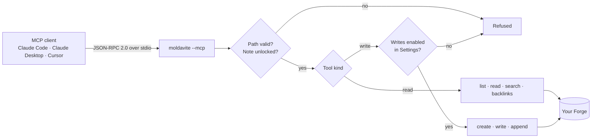
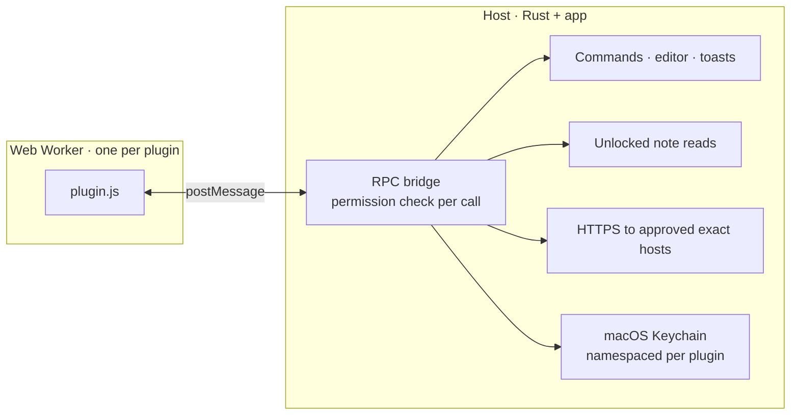
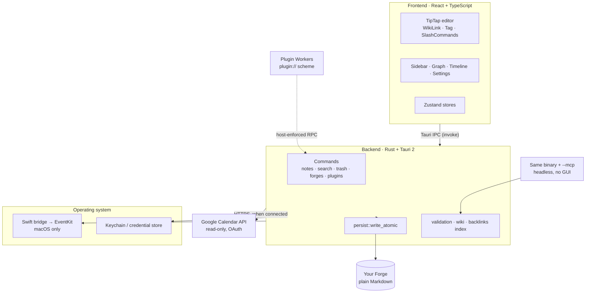

<p align="center">
  
</p>

<h1 align="center">Moldavite</h1>

<p align="center">
  <em>A notes app that never takes your notes.</em>
</p>

<p align="center">
  <a href="https://github.com/mauropereiira/Moldavite/releases/latest"></a>
  
  
  
</p>

<p align="center">
  <a href="https://mauropereiira.github.io/Moldavite/">Website</a> ·
  <a href="https://mauropereiira.github.io/Moldavite/guide.html">User Guide</a> ·
  <a href="docs/PLUGINS.md">Plugin API</a> ·
  <a href="CHANGELOG.md">Changelog</a>
</p>

---

Moldavite is a local-first notes app for macOS. Everything you write is stored as
plain Markdown in a folder you own — no account, no sync service, no telemetry.
It also ships an MCP server, so the AI tools you already use can read your notes
directly on your machine, with writes switched off until you decide otherwise.

The name is a mineral: a green glass formed fifteen million years ago when a
meteorite struck what is now Bavaria, fusing earth and sky into something new.
That is roughly what a good notes app does with a stray thought.

## Why it's different

- **Your data is a folder, not a database.** Open it in Finder, sync it with any
  tool you trust, put it in git, edit it in another app. Moldavite reads the
  changes back.
- **Agents are first-class, and fenced in.** A built-in MCP server exposes four
  read tools by default; the three write tools stay off until you turn them on.
- **The network story is short and checkable.** Update checks, an opt-in model
  download, and the plugin registry when you press Browse. That's the list.

## Install

**[Download the latest release →](https://github.com/mauropereiira/Moldavite/releases/latest)**

| Mac | File |
|-----|------|
| Apple Silicon | `Moldavite_x.x.x_aarch64.dmg` |
| Intel | `Moldavite_x.x.x_x64.dmg` |

Builds are signed, notarized, and updated in place via minisign-verified
auto-update. Requires macOS 10.15 or later.

## The Forge

A **Forge** is a vault: an ordinary directory holding ordinary files. You can
keep as many as you like and switch between them, each with its own plugins,
search index, and window state.

```
~/Documents/Moldavite/<ForgeName>/
├── daily/         # YYYY-MM-DD.md — created on demand, removed when emptied
├── weekly/        # YYYY-Www.md
├── notes/         # standalone notes, nested folders supported
├── templates/     # custom templates (JSON)
├── images/        # pasted and inserted images
├── .trash/        # 7-day retention + metadata.json
└── .plugins/      # installed plugins (<id>/manifest.json + plugin.js)
```

Notes are Markdown with optional YAML frontmatter. Frontmatter keys Moldavite
doesn't recognize are preserved, so metadata written by another tool survives a
save here.

**Every write is atomic** — temp file, fsync, rename, with `0600` permissions
applied before the file becomes visible. A crash or a full disk cannot leave you
with half a note. If a file changed on disk while you had unsaved edits, the disk
version is preserved as a timestamped conflict copy instead of being overwritten.

## AI and agents

The app binary doubles as an MCP server. There is no separate daemon to install
and nothing leaves your machine.

```bash
claude mcp add moldavite -- "/Applications/Moldavite.app/Contents/MacOS/moldavite" --mcp
```

Settings → AI & Agents generates that line with the correct path for your Mac.
Add `--forge "Work"` to point a client at a specific Forge.

| Tool | Does | Default |
|------|------|---------|
| `list_notes` | Enumerate notes and locked-note placeholders, optionally by folder | On |
| `read_note` | Read one unlocked note by Forge-relative path | On |
| `search_notes` | Ranked full-text search with snippets | On |
| `get_backlinks` | Every note linking to a given note | On |
| `create_note` | Create a note | **Off** |
| `write_note` | Replace a note's contents | **Off** |
| `append_to_daily_note` | Append to today's note | **Off** |


```mermaid
flowchart LR
    C["MCP client<br/>Claude Code · Claude Desktop · Cursor"]
    C -- "JSON-RPC 2.0 over stdio" --> S["moldavite --mcp"]
    S --> V{"Path valid?<br/>Note unlocked?"}
    V -- "no" --> X["Refused"]
    V -- "yes" --> T{"Tool kind"}
    T -- "read" --> R["list · read · search · backlinks"]
    T -- "write" --> G{"Writes enabled<br/>in Settings?"}
    G -- "no" --> X
    G -- "yes" --> W["create · write · append"]
    R --> F[("Your Forge")]
    W --> F
```

For agents that just read files rather than speak MCP, one click writes an
`AGENTS.md` describing your Forge's conventions, plus a `.gitignore` for the
directories the app manages itself.

## Semantic search

Opt in and your notes are indexed locally so you can search by meaning rather
than keyword, with a **Related** list of five notes under whatever you're
reading. Choose from three embedding models:

| Model | Good for |
|-------|----------|
| `all-MiniLM-L6-v2` *(default)* | Small, fast, English |
| BGE small English v1.5 | Higher quality English |
| Multilingual E5 small | Non-English vaults |

The model downloads once from Hugging Face after a prompt naming it and its
size. Everything after that runs offline on your Mac. Locked notes are never
indexed. **Requires Apple Silicon** — Intel Macs get keyword search.

## Writing and linking

- TipTap rich-text editor over Markdown-on-disk: headings, task lists, code,
  resizable images, highlights, alignment, slash commands, pinnable tabs
- `[[Wiki links]]` and `[[Display|target]]`, with unresolved links visibly distinct
- **Renaming a note rewrites every inbound link vault-wide** and keeps your open
  tabs, recents, and selection pointed at the right file
- Backlinks panel, `#tags` with global rename, folders, templates with
  `{{date}}` / `{{time}}` / `{{day_of_week}}`
- A force-directed graph where linked components cluster and orphans stay at the
  periphery — draggable, zoomable, with broken links shown rather than dropped
- Quick switcher and command palette on `⌘P`; every shortcut on `⌘?`

## Plugins

Plugins run in a per-plugin Web Worker with no DOM, no network globals, and no
Tauri IPC. Everything a plugin can do crosses an RPC bridge the host enforces,
and consent is pinned to a SHA-256 hash of the manifest plus code — change either
and you are asked again.


```mermaid
flowchart LR
    subgraph WK["Web Worker · one per plugin"]
        P["plugin.js"]
    end
    subgraph HOST["Host · Rust + app"]
        B["RPC bridge<br/>permission check per call"]
        CMD["Commands · editor · toasts"]
        NOTE["Unlocked note reads"]
        NET["HTTPS to approved exact hosts"]
        KC["macOS Keychain<br/>namespaced per plugin"]
    end
    P <-- "postMessage" --> B
    B --> CMD
    B --> NOTE
    B --> NET
    B --> KC
```

| Capability | Requires consent |
|------------|------------------|
| Register commands, read/replace editor selection, toasts | No |
| Read unlocked note metadata and Markdown | Yes |
| HTTPS to named hosts (individually revocable) | Yes |
| Secrets in the macOS Keychain | Yes |
| Host-rendered prompt forms | Yes |
| DOM, `fetch`, WebSockets, Tauri IPC, other plugins' secrets, locked notes | **Never available** |

Install from Settings → Plugins, or from the
[website directory](https://mauropereiira.github.io/Moldavite/plugins.html) via
`moldavite://plugin/<id>` links — which open the entry and show its permissions
rather than installing silently. Downloads are pinned to the registry repository
and Rust verifies both SHA-256 hashes before an atomic install. Enabling a plugin
is always a separate step.

The first-party **Publish to WordPress** plugin is a worked example: it publishes
and updates drafts using Application Passwords.

Writing one? See [docs/PLUGINS.md](docs/PLUGINS.md).

## Privacy and safety

- No account system, no hosted notes service, no analytics, no telemetry
- Individual notes can be locked with AES-256-GCM + Argon2, rate-limited unlock,
  and auto-relock; locked notes are excluded from search, indexing, and every
  agent tool
- Encrypted whole-vault export, plus settings export as JSON
- Trash holds deleted notes for 7 days with read-only previews
- Calendar access is read-only for both sources: Apple is permission-gated
  through EventKit, Google through a `calendar.readonly` OAuth scope you grant
  and can revoke. Events are drawn and discarded, never written to disk

**Every network call Moldavite makes:** a signed update check ~15 seconds after
launch and once a day while open; the plugin registry from GitHub when you press
Browse; a semantic model from Hugging Face after you opt in; Google Calendar
while a Google account is connected; and plugin requests to hosts you approved
by name. Publishing a note to WordPress is an action you take, not a background
behaviour. Full detail: [Privacy Policy](https://mauropereiira.github.io/Moldavite/privacy.html).

## Architecture


```mermaid
flowchart TB
    subgraph FE["Frontend · React + TypeScript"]
        ED["TipTap editor<br/>WikiLink · Tag · SlashCommands"]
        SB["Sidebar · Graph · Timeline · Settings"]
        ST["Zustand stores"]
    end
    subgraph BE["Backend · Rust + Tauri 2"]
        CM["Commands<br/>notes · search · trash · forges · plugins"]
        PS["persist::write_atomic"]
        VA["validation · wiki · backlinks index"]
    end
    subgraph OS["Operating system"]
        SW["Swift bridge → EventKit<br/>macOS only"]
        KC["Keychain / credential store"]
    end
    GC["Google Calendar API<br/>read-only, OAuth"]
    DISK[("Your Forge<br/>plain Markdown")]

    FE -- "Tauri IPC (invoke)" --> BE
    BE --> PS --> DISK
    BE --> SW
    BE --> KC
    BE -- "HTTPS, when connected" --> GC

    MCP["Same binary + --mcp<br/>headless, no GUI"] --> VA
    WORKER["Plugin Workers<br/>plugin:// scheme"] -. "host-enforced RPC" .-> CM
```

The same binary serves three entrypoints: the GUI, a headless MCP server
(`--mcp`, selected before Tauri initializes), and the `moldavite://` deep-link
handler for plugin installs.

```
src/
├── components/   # editor, sidebar, calendar, graph, settings, plugins, updates…
├── hooks/        # useNotes, useAutoSave, useFolders, useAutoLock…
├── stores/       # Zustand + localStorage persistence
└── lib/          # fileSystem.ts (IPC + Markdown conversion), plugins/, validation

src-tauri/
├── src/lib.rs           # command registration, plugin:// scheme, app setup
├── src/main.rs          # entrypoint; picks MCP mode before Tauri starts
├── src/mcp/             # stdio JSON-RPC protocol, tool schemas, dispatch
├── src/commands/        # by domain: notes, search, forges, plugins, locking…
├── src/persist.rs       # config/trash IO + write_atomic
├── src/validation.rs    # path-safety checks
├── src/encryption.rs    # AES-GCM + Argon2 note locking
├── src/secrets.rs       # OS credential store (plugins + calendar accounts)
├── src/calendar/        # source dispatch, apple (EventKit), google (REST + OAuth)
└── src-swift/           # Swift bridge for Calendar
```

## Build from source

```bash
git clone https://github.com/mauropereiira/Moldavite.git
cd Moldavite
npm install
npm run tauri dev
```

Requires Node.js 18+, Rust 1.77+, and Xcode Command Line Tools.

```bash
npm test                     # frontend tests (vitest)
cd src-tauri && cargo test    # backend tests, incl. stress suite
npm run lint                 # ESLint
npm run check:size           # bundle-size budget
npm run tauri build          # production DMG + .app
```

See [CONTRIBUTING.md](CONTRIBUTING.md) for conventions and pull request
expectations, and [docs/PROJECT_STATUS.md](docs/PROJECT_STATUS.md) for what's
shipped, what's known-broken, and what's next.

## Known limits

- Search is a live directory scan per query — fine to roughly a thousand notes.
  A persistent index is the next major piece of work.
- The plugin API has note reads but no note writes and no UI panels yet.
- All note metadata is held in memory; there is no pagination.
- No automatic scheduled backups yet (manual and encrypted export exist).
- No multi-window support.

## Stack

React · TypeScript · TipTap · Tauri 2 · Rust · Swift · Vite

---

<p align="center">
  <sub>Made by <a href="https://github.com/mauropereiira">Mauro Pereira</a> · MIT License</sub>
</p>
