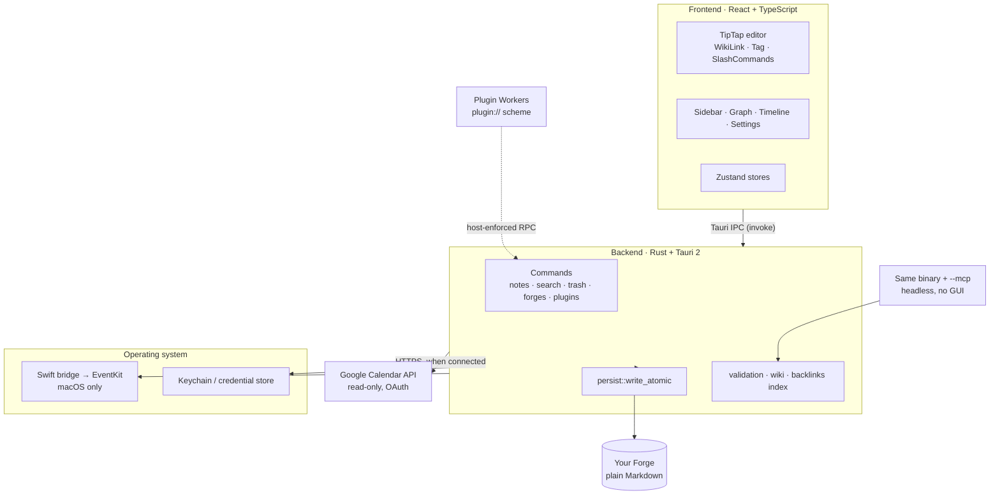
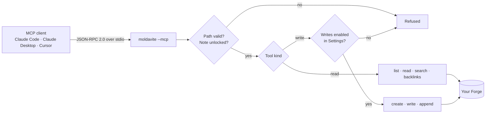

# Architecture

How Moldavite is put together. For where to start editing, see
[CONTRIBUTING.md](../CONTRIBUTING.md). For feature status and known debt, see
[PROJECT_STATUS.md](PROJECT_STATUS.md).

## Three entrypoints, one binary



The same binary serves three entrypoints:

- the GUI,
- a headless MCP server (`--mcp`, selected in `src-tauri/src/main.rs` before
  Tauri initializes, so no window, Dock icon, or event loop is created),
- the `moldavite://` deep-link handler for plugin installs.

Because the `--mcp` branch returns before Tauri starts and resolves every path
from `$HOME` rather than the bundle, the executable also runs correctly from
outside `Moldavite.app`. That is what lets the Homebrew cask symlink it onto
`PATH` as `moldavite`.

## MCP request path



The write gate is re-read per request, so revoking write access in Settings takes
effect on sessions that are already connected. When writes are off the three
write tools are not listed at all, not merely refused.

## Plugin sandbox


Plugins run in a per-plugin Web Worker with no DOM, no network globals, and no
Tauri IPC. Everything a plugin can do crosses an RPC bridge the host enforces,
and consent is pinned to a SHA-256 hash of the manifest plus code, so changing
either re-prompts the user.

| Capability | Requires consent |
|------------|------------------|
| Register commands, read/replace editor selection, toasts | No |
| Read unlocked note metadata and Markdown | Yes |
| HTTPS to named hosts (individually revocable) | Yes |
| Secrets in the macOS Keychain | Yes |
| Host-rendered prompt forms | Yes |
| DOM, `fetch`, WebSockets, Tauri IPC, other plugins' secrets, locked notes | **Never available** |

The full authoring surface is in [PLUGINS.md](PLUGINS.md).

## Source layout

```
src/
├── components/   # editor, sidebar, calendar, graph, settings, plugins, updates…
├── hooks/        # useNotes, useAutoSave, useFolders, useAutoLock…
├── stores/       # Zustand + localStorage persistence
└── lib/          # fileSystem.ts (IPC + Markdown conversion), plugins/, validation

src-tauri/
├── src/lib.rs           # command registration, plugin:// scheme, app setup
├── src/main.rs          # entrypoint; picks MCP mode before Tauri starts
├── src/mcp/             # stdio JSON-RPC protocol, tool schemas, dispatch
├── src/commands/        # by domain: notes, search, forges, plugins, locking…
├── src/persist.rs       # config/trash IO + write_atomic
├── src/validation.rs    # path-safety checks
├── src/encryption.rs    # AES-GCM + Argon2 note locking
├── src/secrets.rs       # OS credential store (plugins + calendar accounts)
├── src/calendar/        # source dispatch, apple (EventKit), google (REST + OAuth)
└── src-swift/           # Swift bridge for Calendar
```

## Storage invariants

Every write to user data goes through `persist::write_atomic`: temp file, fsync,
rename, with `0600` applied before the file becomes visible. A crash or a full
disk cannot leave a half-written note. If a file changed on disk while the editor
held unsaved edits, the disk version is preserved as a timestamped conflict copy
rather than overwritten.

Frontmatter keys Moldavite does not recognize are round-tripped untouched, so
metadata written by another tool survives a save here.
