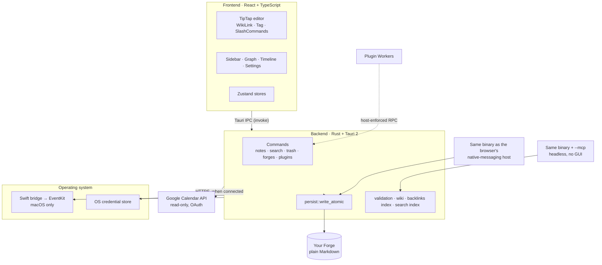
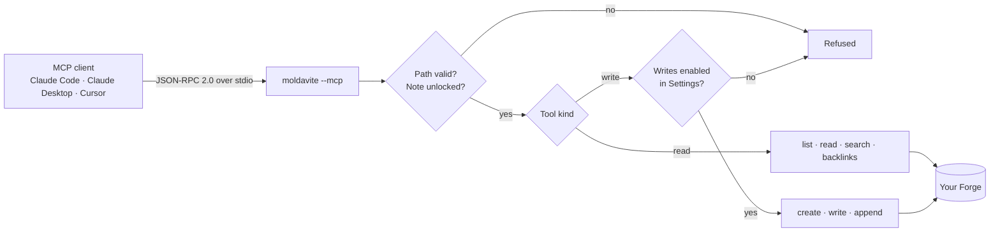
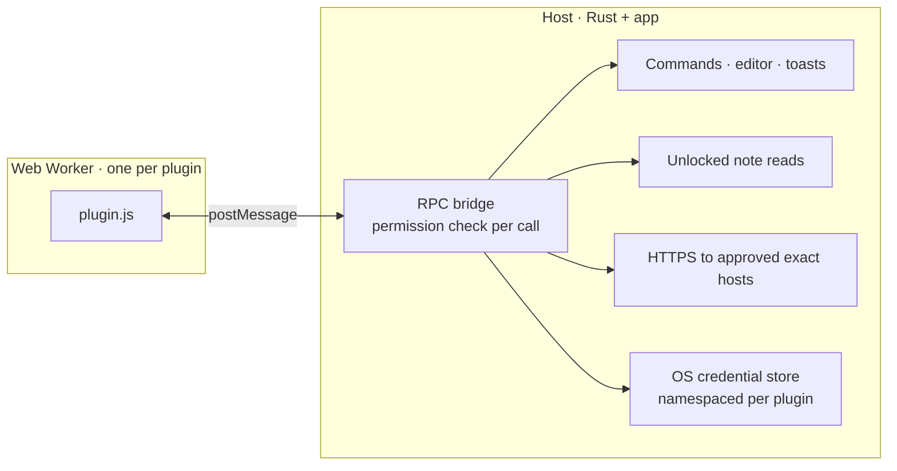

# Architecture

How Moldavite is put together. For where to start editing, see
[CONTRIBUTING.md](../CONTRIBUTING.md). For feature status and known debt, see
[PROJECT_STATUS.md](PROJECT_STATUS.md).

## Four entrypoints, one binary



The same binary serves four entrypoints. `src-tauri/src/main.rs` picks between
the two headless ones before Tauri initializes, so neither creates a window, a
Dock icon, or an event loop:

- the GUI,
- a headless MCP server (`--mcp`),
- the browser clipper's native-messaging host, which the browser starts with the
  arguments its manifest passes (`browser_host::is_browser_host_launch`); both
  headless modes own stdin and stdout, which is why a window would be a bug the
  caller cannot see,
- the `moldavite://` deep-link handler for plugin installs and OAuth callbacks,
  inside the GUI process.

Because the `--mcp` branch returns before Tauri starts and resolves every path
from `$HOME` rather than the bundle, the executable also runs correctly from
outside `Moldavite.app`. That is what lets the Homebrew cask symlink it onto
`PATH` as `moldavite`.

## MCP request path



The write gate is re-read per request, so revoking write access in Settings takes
effect on sessions that are already connected. When writes are off the three
write tools are not listed at all, not merely refused.

## Plugin sandbox



Plugins run in a per-plugin Web Worker with no DOM, no network globals, and no
Tauri IPC. Everything a plugin can do crosses an RPC bridge the host enforces,
and consent is pinned to a SHA-256 hash of the manifest plus code, so changing
either re-prompts the user.

| Capability | Requires consent |
|------------|------------------|
| Register commands (`commands`) | Yes |
| Read the active note and insert text (`editor`) | Yes |
| Toasts and host-rendered prompt forms (`ui`) | Yes |
| Read unlocked note metadata and Markdown | Yes |
| HTTPS to named hosts (individually revocable) | Yes |
| Secrets in the OS credential store | Yes |
| DOM, `fetch`, WebSockets, Tauri IPC, other plugins' secrets, locked notes | **Never available** |

Nothing beyond `api.app` is free. `ui` and `commands` were once ungated, and
both put something in front of the user under Moldavite's own chrome, so a
plugin that declared nothing could ask for a passphrase in a host-styled
dialog.

The full authoring surface is in [PLUGINS.md](PLUGINS.md).

The `keyring` backend stores secrets in the macOS Keychain on macOS, Windows
Credential Manager on Windows, and the Secret Service (GNOME Keyring or KWallet)
on Linux. Plugin account names remain isolated within the same `Moldavite`
service on every platform.

## Source layout

```
src/
├── components/   # editor, sidebar, calendar, graph, settings, plugins, updates…
├── hooks/        # useNotes, useAutoSave, useFolders, useAutoLock…
├── stores/       # Zustand + localStorage persistence
└── lib/          # fileSystem.ts (IPC + Markdown conversion), plugins/, validation

src-tauri/
├── src/lib.rs           # command registration, app setup
├── src/main.rs          # entrypoint; picks MCP mode before Tauri starts
├── src/mcp/             # stdio JSON-RPC protocol, tool schemas, dispatch
├── src/commands/        # by domain: notes, search, forges, plugins, locking…
├── src/persist.rs       # config/trash IO + write_atomic
├── src/validation.rs    # path-safety checks
├── src/encryption.rs    # AES-GCM + Argon2 note locking
├── src/secrets.rs       # OS credential store (plugins + calendar accounts)
├── src/plugin_net.rs    # the Rust side of plugin `net.fetch`: allowlist, redirects, caps
├── src/browser_host.rs  # native-messaging host for the browser clipper
├── src/search_index.rs  # per-Forge SQLite FTS5 keyword index, outside the Forge
├── src/semantic.rs      # local embeddings index and query engine
├── src/cloud_forge.rs   # the optional iCloud Forge on macOS and iOS
├── src/backlinks_index.rs # wiki-link graph used by backlinks and the graph view
├── src/calendar/        # source dispatch, apple (EventKit), google (REST + OAuth)
├── src/wordpress/       # built-in WordPress.com publishing (OAuth + REST)
└── src-swift/           # Swift bridge for Calendar
```

## Storage invariants

Every write to user data goes through `persist::write_atomic`: temp file, fsync,
rename, then an fsync of the containing directory on Unix so the entry naming
the new bytes is as durable as the bytes themselves. On Unix the temp file is opened `0600`, so the mode is in place before
the file becomes visible; on Windows the file inherits its directory's ACLs and
no owner-only guarantee is made. A crash or a full disk cannot leave a
half-written note. If a file changed on disk while the editor
held unsaved edits, the disk version is preserved as a timestamped conflict copy
rather than overwritten.

Frontmatter keys Moldavite does not recognize are round-tripped untouched, so
metadata written by another tool survives a save here.
